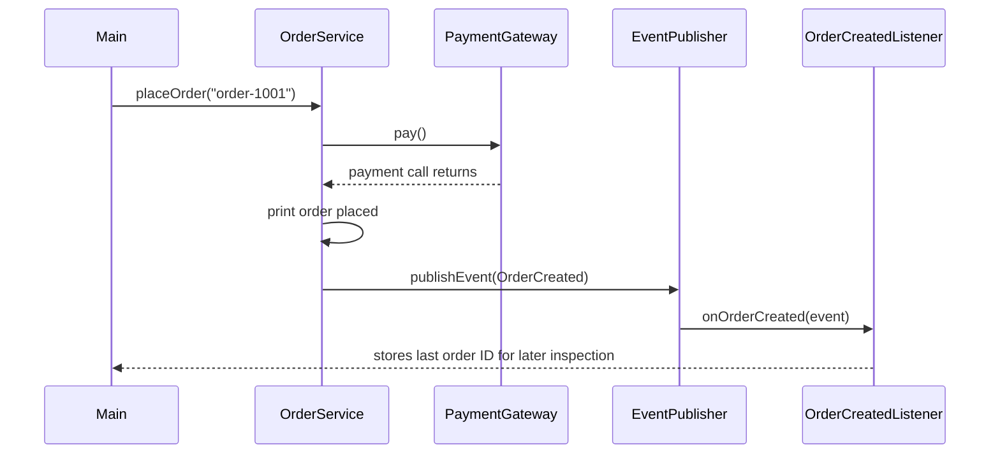

# MiniSpring Demo & Verification Guide

This guide is the practical companion to [MiniSpring Internals](MINISPRING_INTERNALS.md). It shows how to run the project and connect the output to the code that produced it.

## 1. Run the test suite first

From the project root:

```bash
mvn test
```

Tests check specific behavior in isolation. Run them before trying the demo so a failure can be narrowed down more easily.

For a fuller Maven verification:

```bash
mvn clean verify
```

## 2. Run the demonstration application

```bash
mvn package
java -jar target/mini-spring-container-0.1.0-SNAPSHOT.jar
```

The entry point is `com.minispring.demo.Main`.

`Main` creates an `Environment`, activates the `dev` profile, enables a property, creates an `ApplicationContext`, and requests several beans. The context is used in a try-with-resources block so `close()` is called when the block exits.

## 3. What the demo demonstrates

### A. Environment setup

In `Main`:

```java
Environment environment = new Environment();
environment.addProfile("dev");
environment.setProperty("feature.enabled", "true");
```

The context uses these values while deciding which conditional definitions should be registered. They should be configured before constructing the context.

### B. Dependency injection and qualifiers

`OrderService` declares dependencies through its constructor:

```java
@Inject
public OrderService(
        @Qualifier("razorpay") PaymentGateway gateway,
        EventPublisher eventPublisher) {
    // ...
}
```

The container resolves the `PaymentGateway` interface to the qualified implementation and supplies the event publisher. The service does not construct those dependencies itself.

### C. Factory methods

`AppConfig` contains `@Bean` methods:

```java
@Bean
public PaymentGateway paymentGateway() {
    return new StripeGateway();
}
```

A factory method is represented by a `BeanDefinition`. The container resolves its parameters (if any), invokes it when its bean is requested, then applies the ordinary lifecycle pipeline to the returned object.

The demo also requests `FactoryArgumentTest`, whose factory method takes a `Logger` parameter. This shows that factory-method arguments use container resolution rather than manual construction.

### D. Application events

The order flow is:



`OrderService` publishes an `OrderCreated` event after the payment call returns and the order message is printed. The listener updates its state and prints a notification. In this implementation, event dispatch is synchronous, so the listener method runs during `publishEvent(...)`.

### E. Prototype scope and `Provider<T>`

The demo asks a `ScopeConsumer` for two prototype objects. The intended result is that the two references are different. `Provider<T>` is useful because it defers resolution until `get()` is called; a singleton can therefore request a fresh prototype on demand rather than holding only the one instance injected at construction time.

## 4. Follow one bean through the framework

For `OrderService`, the simplified path is:

```text
Main
  |
  v
ApplicationContext.getBean(OrderService.class)
  |
  v
Container selects OrderService definition
  |
  +--> resolve PaymentGateway using qualifier "razorpay"
  |
  +--> resolve EventPublisher
  |
  v
Invoke OrderService constructor
  |
  v
Aware callbacks, if implemented
  |
  v
beforeInitialization processors
  |
  v
initialize(), if implemented
  |
  v
afterInitialization processors
  |
  v
Cache singleton and return
```

For exact behavior and limitations, consult the detailed lifecycle diagram in `MINISPRING_INTERNALS.md`.

## AOP example

AOP is configured explicitly through the three-argument `ApplicationContext` constructor. Each `InterceptorBinding` combines a method matcher and interceptor. A matching interceptor must call `invocation.proceed()` to continue toward the real target.

The standalone examples live in `com.minispring.demo.aop`. For the container-integrated version, inspect `AopApplicationContextIntegrationTest`: it demonstrates automatic proxying and injection through an interface. A JDK proxy is not an instance of the target implementation class, and a target's direct self-invocation does not cross the proxy.

## 5. Test map

| Test class | What it focuses on |
|---|---|
| `ContainerInfrastructureTest` | Core container/infrastructure behavior |
| `ApplicationContextEventIntegrationTest` | Event publication through a real context |
| `EventListenerMethodScannerTest` | Validation of `@EventListener` methods |
| `EventPublisherTest` | Synchronous dispatch and failure behavior |
| `BeanNameAwareTest` | Basic bean-name callback contract |
| `BeanNameAwareIntegrationTest` | Name callback and lifecycle order |
| `BeanResolverAwareIntegrationTest` | Resolver supplied by the container |
| `ApplicationContextBeanNameTest` | Name assigned to a scanned component |
| `ApplicationContextFactoryBeanNameTest` | Name assigned from an `@Bean` method |
| `ApplicationContextAwareIntegrationTest` | Owning context supplied to a component |

The tests are not a claim that all Spring behavior is implemented. Each test documents the subset that MiniSpring currently supports.

## 6. When a test fails

Use this sequence:

1. Read the first test error and the first relevant `Caused by`.
2. Identify whether the failure is compilation, discovery, candidate selection, dependency resolution, lifecycle, or assertion behavior.
3. Fix the smallest responsible area.
4. Run the failing test or class first, then run `mvn test`.
5. Inspect `git diff` before committing the completed change.

Example: if the container reports `No bean found for java.util.List`, check whether a test bean has a constructor parameter of type `List`. MiniSpring treats constructor parameters as dependencies; a test-only callback list should not accidentally become a container dependency.

## 7. A sensible development checkpoint

At the end of a meaningful subsystem:

```bash
mvn test
git diff --check
git status
git diff
```

Review the changes, stage only the intended files, then commit. Push after confirming the commit is correct.

The project is being built incrementally. Small, verified milestones make the implementation easier to learn and the Git history easier to understand.
