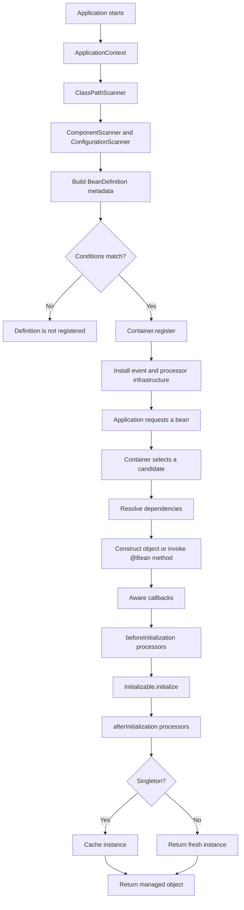
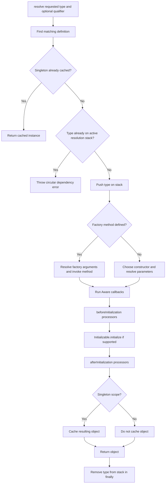
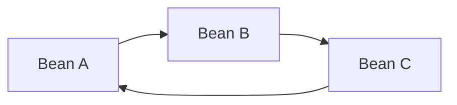
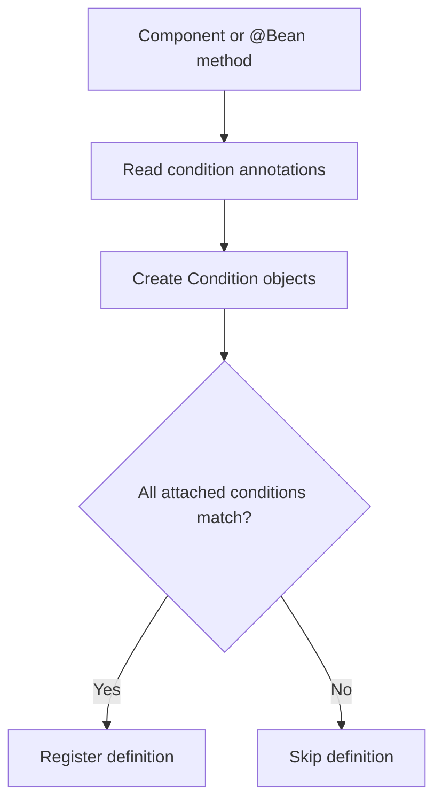
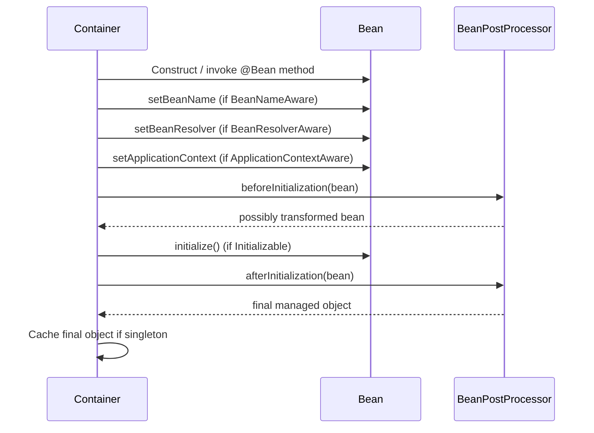
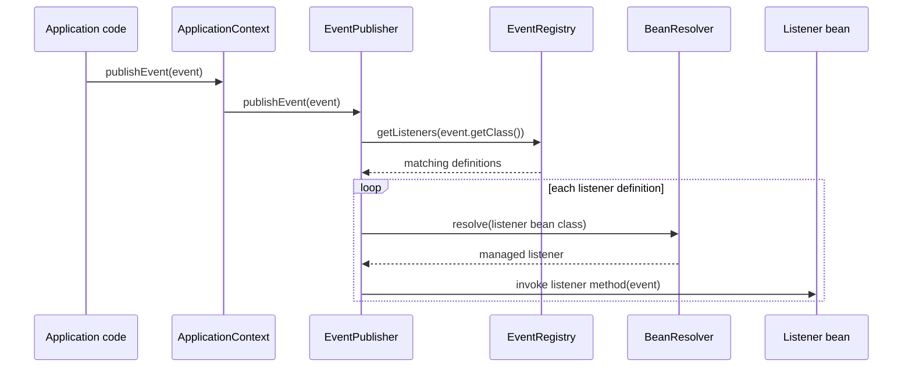
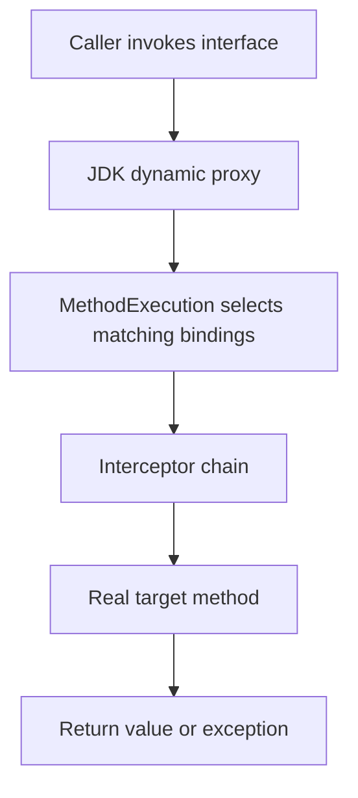

# MiniSpring Internals

This document is the detailed companion to the [README](README.md). It explains what each part of MiniSpring does, why it exists, how a request moves through the framework, and what the current implementation does **not** promise.

The goal is not to describe all of Spring. The goal is to make this repository understandable enough that each next feature—can be added without treating the container as a black box.

## 1. What problem does MiniSpring solve?

Without a container, application code often constructs dependencies itself:

```java
PaymentGateway gateway = new StripeGateway();
OrderService service = new OrderService(gateway);
```

This is explicit and valid, but the application must decide which implementation to construct, how to share instances, and when resources should be initialized or destroyed.

MiniSpring moves those decisions into a framework:

```java
try (ApplicationContext context =
         new ApplicationContext("com.minispring.demo")) {

    OrderService service = context.getBean(OrderService.class);
    // Use the managed service.
}
```

The context discovers eligible components, builds metadata, and delegates object creation to the container. Application code asks for a bean instead of manually assembling the entire object graph.

## 2. Big picture



The central boundary is:

- **Scanners discover.**
- **`ApplicationContext` orchestrates.**
- **`BeanDefinition` describes.**
- **`Container` resolves and creates.**
- **Lifecycle contracts let managed objects participate in creation and shutdown.**

This separation is one of the most important design choices in the project.

## 3. Source tree and responsibilities

```text
src/main/java/com/minispring/
├── annotation/
│   ├── Bean.java
│   ├── BeanScope.java
│   ├── Component.java
│   ├── Configuration.java
│   ├── Inject.java
│   ├── Primary.java
│   ├── Qualifier.java
│   ├── Profile.java
│   ├── ConditionalOnProperty.java
│   └── EventListener.java
├── condition/
│   ├── Condition.java
│   ├── ProfileCondition.java
│   └── PropertyCondition.java
├── context/
│   ├── ApplicationContext.java
│   └── Environment.java
├── core/
│   ├── BeanDefinition.java
│   ├── BeanResolver.java
│   ├── Container.java
│   ├── Provider.java
│   └── Scope.java
├── events/
│   ├── EventListenerDefinition.java
│   ├── EventListenerMethodScanner.java
│   ├── EventRegistry.java
│   ├── EventPublisher.java
│   └── EventDispatchException.java
├── lifecycle/
│   ├── Initializable.java
│   ├── Destroyable.java
│   ├── BeanPostProcessor.java
│   ├── BeanFactoryPostProcessor.java
│   ├── BeanNameAware.java
│   ├── BeanResolverAware.java
│   └── ApplicationContextAware.java
├── scanner/
│   ├── ClassPathScanner.java
│   ├── ComponentScanner.java
│   ├── ConfigurationScanner.java
│   └── BeanMethod.java
└── demo/
    └── Example application classes
```

### Package guide

| Package | Responsibility | What it should not own |
|---|---|---|
| `annotation` | Runtime metadata declared by application classes | Creating beans |
| `scanner` | Finding classes and annotated methods | Deciding whether conditions match or invoking factory methods |
| `condition` | Answering whether a condition matches an `Environment` | Registering or creating beans |
| `context` | Application setup, environment, public API, orchestration | Low-level constructor resolution |
| `core` | Definitions, candidate selection, dependency resolution, scopes, lifecycle | Package scanning |
| `lifecycle` | Contracts that beans/processors can implement | Orchestrating the whole application |
| `events` | Listener metadata, registry, synchronous dispatch | Owning bean construction |
| `demo` | Examples that exercise the framework | Framework infrastructure |

## 4. `ApplicationContext`: the application setup coordinator

**File:** `src/main/java/com/minispring/context/ApplicationContext.java`

Think of `ApplicationContext` as the coordinator that prepares the application. It does not duplicate the container's resolution algorithm.

### Construction phases

The constructor follows explicit phases.

#### Phase 0 — Discovery

1. `ClassPathScanner` finds loadable classes under the requested package.
2. `ComponentScanner` selects classes annotated with `@Component`.
3. `ConfigurationScanner` finds `@Bean` methods declared by `@Configuration` classes.

Discovery produces candidates; it does not instantiate every application bean.

#### Phase 1 — Build and register definitions

For each component or configuration class, the context creates a `BeanDefinition` containing information such as class, scope, qualifier, primary status, name, and conditions.

Each `@Bean` method becomes a factory-method definition. The method's return type is the definition's bean type, and the method itself records how to create the object.

Before registration, `conditionsMatch(...)` evaluates all conditions on the definition. A definition that does not match is skipped.

#### Phase 1.5 — Event infrastructure

The context registers `EventRegistry` and `EventPublisher` through the normal container mechanism. It scans eligible component classes for `@EventListener` methods and registers their listener metadata.

The current listener discovery path scans component classes. It does not discover listener methods on arbitrary objects returned from `@Bean` methods.

#### Phase 2 — `BeanFactoryPostProcessor`

Eligible factory post-processors are resolved and invoked with the container. They operate on container metadata before ordinary application beans are requested.

#### Phase 3 — `BeanPostProcessor`

Eligible bean post-processors are resolved and added to the container's processor chain. Beans created later pass through that chain.

### Context public API

| Method | Purpose |
|---|---|
| `getBean(Class<T>)` | Resolve a bean by type |
| `getBean(Class<T>, String)` | Resolve a bean by type and qualifier |
| `publishEvent(Object)` | Delegate event delivery to `EventPublisher` |
| `getEnvironment()` | Access the context's environment |
| `close()` | Ask the container to destroy managed singletons |

### Important consequence

The `Environment` is used while the context is being built. Configure profiles and properties before constructing the context if they should affect component registration.

## 5. `Container`: runtime resolution engine

**File:** `src/main/java/com/minispring/core/Container.java`

The container owns the runtime work: selecting a definition, resolving dependencies, creating an object, running lifecycle hooks, caching singletons, and detecting cycles.

Its main state is:

| Field | Meaning |
|---|---|
| `definitions` | Registered `BeanDefinition` objects, keyed by bean class |
| `instances` | Created singleton objects, keyed by bean class |
| `resolutionStack` | The current chain of beans being resolved |
| `postProcessors` | Processors applied around initialization |
| `singletonCreationOrder` | Singleton order used for reverse-order destruction |
| `applicationContext` | Context supplied to `ApplicationContextAware` beans |

The container registers itself as a `BeanResolver` infrastructure object. This allows a bean to depend on the narrower resolver interface rather than depending directly on the concrete `Container`.

### Resolution flow



The `finally` block removes the active type even if creation fails. Without this cleanup, one failed resolution could leave stale entries that make later requests look circular.

### Candidate selection

The current selection process considers definitions whose registered bean class is assignable to the requested type.

At a high level:

1. An explicit qualifier narrows the candidates.
2. If one candidate remains, use it.
3. If several candidates remain, a unique `@Primary` candidate can decide.
4. If the result is missing or ambiguous, resolution fails with an exception.

This is how a caller can request an interface while the container returns a concrete implementation.

### Constructor injection

For class-backed definitions, the container chooses a constructor and resolves its parameters. A constructor annotated with `@Inject` is preferred by the project's selection logic; otherwise the container uses its supported fallback rule.

Every normal constructor parameter is resolved through the container. The special `Provider<T>` case is different because the target is intentionally resolved later.

### Factory-method creation

For a definition created from an `@Bean` method:

1. Resolve the configuration class instance when the factory method is non-static.
2. Resolve the method's parameters.
3. Invoke the method.
4. Continue with the same Aware and lifecycle pipeline used by constructor-created beans.

This keeps dependency resolution consistent regardless of how an object is constructed.

## 6. `BeanDefinition`: metadata is not the object

**File:** `src/main/java/com/minispring/core/BeanDefinition.java`

A definition is a description of a bean, not the bean instance itself.

It currently stores:

- bean class
- scope
- optional qualifier
- primary flag
- optional factory method
- conditions
- bean name

The context can inspect and decide whether a definition should be registered before the container creates the object. This is why metadata and runtime instances are stored separately.

### Current bean-name limitation

`ApplicationContext` derives a component name from the class's simple name, and an `@Bean` method's name from the method name. The container invokes `BeanNameAware` with that metadata.

However, **the container maps are keyed by `Class<?>`, not by bean name**. Therefore the current implementation does not support two separately registered beans of the same class under different names. A bean name is currently awareness metadata; it is not yet a general name-based lookup key.

## 7. Scanning: find first, interpret second

### `ClassPathScanner`

Looks under the requested package path and loads discovered `.class` files.

### `ComponentScanner`

Filters a list of classes to those annotated with `@Component`.

### `ConfigurationScanner`

Finds `@Bean` methods inside `@Configuration` classes and represents each with `BeanMethod` metadata.

This two-step approach separates low-level discovery ("what classes exist?") from framework meaning ("which classes are components?").

**Current limitation:** `ClassPathScanner` is a simple directory-based scanner. It is not a complete scanner for nested JARs, Java modules, or every class-loader arrangement.

## 8. Scopes and caching

MiniSpring currently supports `SINGLETON` and `PROTOTYPE`.

### Singleton

The first successful resolution creates the object and stores the resulting managed object in `instances`. Later resolutions of the same registered class return the cached object.

```text
resolve(Service) -> Service #1
resolve(Service) -> Service #1
resolve(Service) -> Service #1
```

### Prototype

The container creates a new object on each resolution and does not cache it.

```text
resolve(Service) -> Service #1
resolve(Service) -> Service #2
resolve(Service) -> Service #3
```

A singleton that receives a prototype directly during construction retains that particular prototype reference. It does not magically receive a new prototype each time it uses the field.

## 9. Circular dependencies and `Provider<T>`

Suppose constructor dependencies form this cycle:



While resolving the chain, `resolutionStack` records the active path. If the container reaches a type that is already on that path, it reports a circular dependency instead of recursing indefinitely.

`Provider<T>` defers a dependency. The provider can be injected now, while its `get()` method resolves the target later.

```text
Normal dependency:  A needs B now  -> resolve B during A construction
Provider dependency: A needs Provider<B> -> create provider now
                                            resolve B when get() is called
```

This can break a construction-time cycle when the dependency is genuinely safe to defer. It is not a universal fix for every circular design.

## 10. Environment and conditional registration

`Environment` stores:

- active profile names
- string properties

`ProfileCondition` matches when at least one configured profile is active. `PropertyCondition` compares a property's actual value with the expected value.

The context converts `@Profile` and `@ConditionalOnProperty` annotations into `Condition` objects, then checks them before registration.



This means an inactive component is not merely constructed and ignored later; its definition is not registered.

## 11. Lifecycle callbacks and post-processors

After the object has been created, MiniSpring follows this current sequence:



### Lifecycle contracts

- `Initializable`: lets a bean perform initialization after construction and before the after-initialization processors.
- `Destroyable`: lets a managed singleton release resources during shutdown.
- `BeanPostProcessor`: can inspect or replace an object around initialization.
- `BeanFactoryPostProcessor`: can inspect or alter container metadata before regular bean use.
- `BeanNameAware`: receives the definition's bean name.
- `BeanResolverAware`: receives the container's resolver interface.
- `ApplicationContextAware`: receives the owning context in this MiniSpring implementation.

### AOP uses the post-processor extension point

`afterInitialization` may return a different object. MiniSpring uses this extension point through `AopBeanPostProcessor` to wrap eligible beans in JDK dynamic proxies. The implementation is intentionally limited to interface-based proxies and explicitly configured `InterceptorBinding` objects.

### Important limitation

`ApplicationContextAware` beans need a context to have been supplied. A bare `Container` can be created independently, so context-aware beans resolved directly from that container do not have the same guarantee as beans created through `ApplicationContext`.

## 12. Shutdown

`ApplicationContext.close()` delegates to `Container.destroySingletons()`.

The container tracks singleton creation order and destroys managed singleton objects in reverse order. This is useful because an object created later may depend on an object created earlier; reverse order generally lets dependent resources shut down first.

Prototype instances are not retained in the singleton cache and are not managed through the same singleton destruction list.

## 13. Application events

The event subsystem has four main pieces:

| Component | Responsibility |
|---|---|
| `EventListenerMethodScanner` | Finds and validates methods annotated with `@EventListener` |
| `EventListenerDefinition` | Stores listener bean class, method, and event type |
| `EventRegistry` | Maps an event type to listener definitions |
| `EventPublisher` | Resolves listener beans and invokes listener methods |

### Event flow



Current behavior:

- Dispatch is synchronous.
- Matching uses the event's exact runtime class.
- Listener methods must be instance methods with exactly one non-primitive parameter and `void` return type.
- A failure is wrapped in `EventDispatchException` and stops the dispatch loop.
- The publisher reuses the same resolved listener bean for multiple listener methods on the same class during a single dispatch.
- Listener discovery currently scans eligible component classes, not every possible factory-produced object.

There is no asynchronous queue, retry mechanism, event broker, or superclass/interface event matching yet.

## 14. Aware interfaces: why and when

Aware callbacks give a managed object specific container-related information.

| Interface in this project | What it provides | Typical reason |
|---|---|---|
| `BeanNameAware` | Registered name from `BeanDefinition` | Diagnostics or name-sensitive framework behavior |
| `BeanResolverAware` | `BeanResolver` capability | Genuine dynamic lookup at runtime |
| `ApplicationContextAware` | Owning `ApplicationContext` | Need for broader application-level capabilities |

Prefer constructor injection for ordinary dependencies. Use the narrowest capability that solves the problem. Direct context access is convenient but couples the bean to the framework.

`BeanResolverAware` is a MiniSpring-specific teaching interface. The project interface named `ApplicationContextAware` has the same general purpose as Spring's interface, but this is still MiniSpring's own API.

## 15. Tests and what they prove

Tests are under `src/test/java/com/minispring/`. They should be read alongside the implementation, not treated as a replacement for understanding it.

Current test groups include:

- `ContainerInfrastructureTest`: core container behavior
- `ApplicationContextEventIntegrationTest`: event publication through the context
- `EventListenerMethodScannerTest`: listener method validation/discovery
- `EventPublisherTest`: event dispatch behavior
- `BeanNameAwareIntegrationTest`: name callback and lifecycle ordering
- `BeanResolverAwareIntegrationTest`: resolver injection and lookup
- `ApplicationContextBeanNameTest`: component name assignment
- `ApplicationContextFactoryBeanNameTest`: factory-method name assignment
- `ApplicationContextAwareIntegrationTest`: receiving the owning context
- `BeanNameAwareTest`: interface-level behavior

A passing test proves the specific behavior it exercises; it does not imply full Spring compatibility.

## 16. Known limitations and deliberate simplifications

| Area | Current behavior / limitation |
|---|---|
| Bean identity | Definitions and singleton cache are keyed by class; same-class named duplicates are unsupported |
| Bean names | Stored in definitions and supplied to aware beans, but not a full name-based lookup system |
| Classpath scanning | Simple directory scanner; not robust JAR/module scanning |
| Concurrency | No claim of thread-safe concurrent bean creation |
| Dependency resolution | A deliberately small set of constructor and candidate-selection rules |
| Prototype destruction | Not tracked like singleton destruction |
| Events | Synchronous, exact-class dispatch; no retry/async infrastructure |
| Listener discovery | Scans eligible component classes; factory-produced listener objects are not discovered |
| AOP | Configured method matchers, ordered interceptors, and JDK interface proxies; no class proxies or full Spring AOP compatibility |
| Spring compatibility | Educational subset; not drop-in compatible with the Spring Framework |

These constraints are useful boundaries for future development. Improvements should be added deliberately, with tests and updated documentation.

## 17. Build, test, and run

From the project root:

```bash
mvn test
mvn clean verify
mvn package
java -jar target/mini-spring-container-0.1.0-SNAPSHOT.jar
```

Use `mvn test` after each meaningful change. When a subsystem is complete, review `git diff`, commit the milestone, and push when ready.

## 18. AOP: from repeated behavior to an interceptor chain

MiniSpring AOP addresses the problem of applying behavior such as logging or timing around service calls without copying that behavior into every service.



- `MethodMatcher` decides which interface methods are eligible.
- `InterceptorBinding` pairs a matcher with a `MethodInterceptor`.
- `Invocation` represents one method call and advances the chain through `proceed()`.
- `AopBeanPostProcessor` creates a proxy after initialization when a binding matches.

The implementation is educational, not Spring-compatible. It uses JDK interface proxies; calls made by a target to another method on `this` bypass the proxy (self-invocation), and a proxied bean should be requested through its interface. The method-name matcher also matches every overload with that name.

---

## Learning pattern

```text
Problem
  ↓
Why does it matter?
  ↓
Simple model
  ↓
Where does the model fail?
  ↓
Small abstraction
  ↓
Implementation
  ↓
Tests
  ↓
Documentation and milestone commit
```

That is the intended way to keep MiniSpring understandable as it grows.
