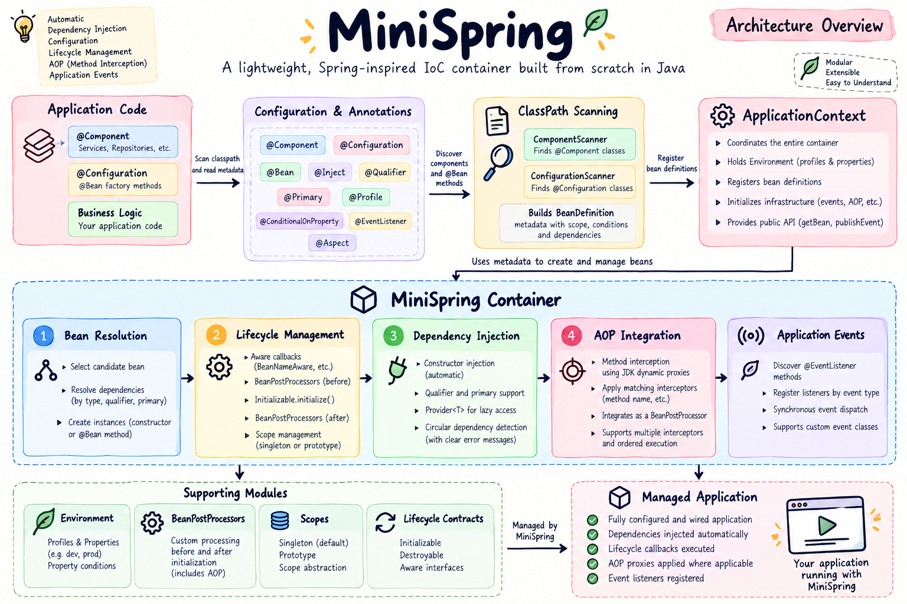
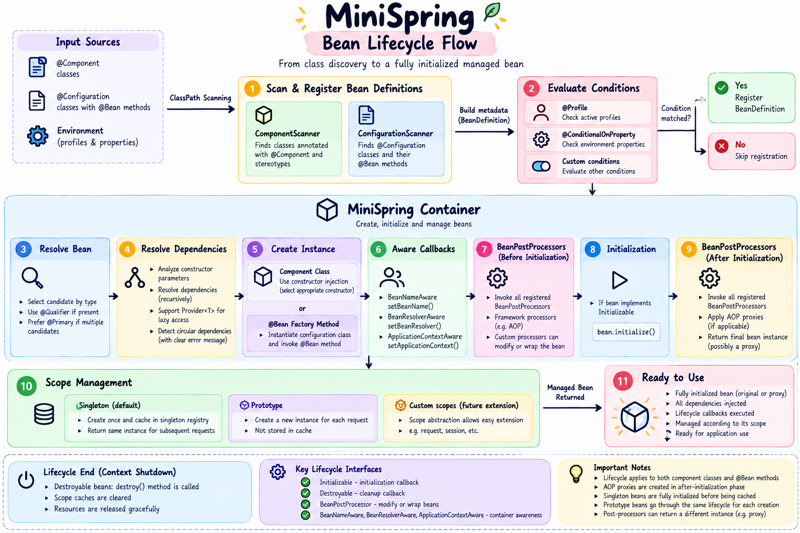
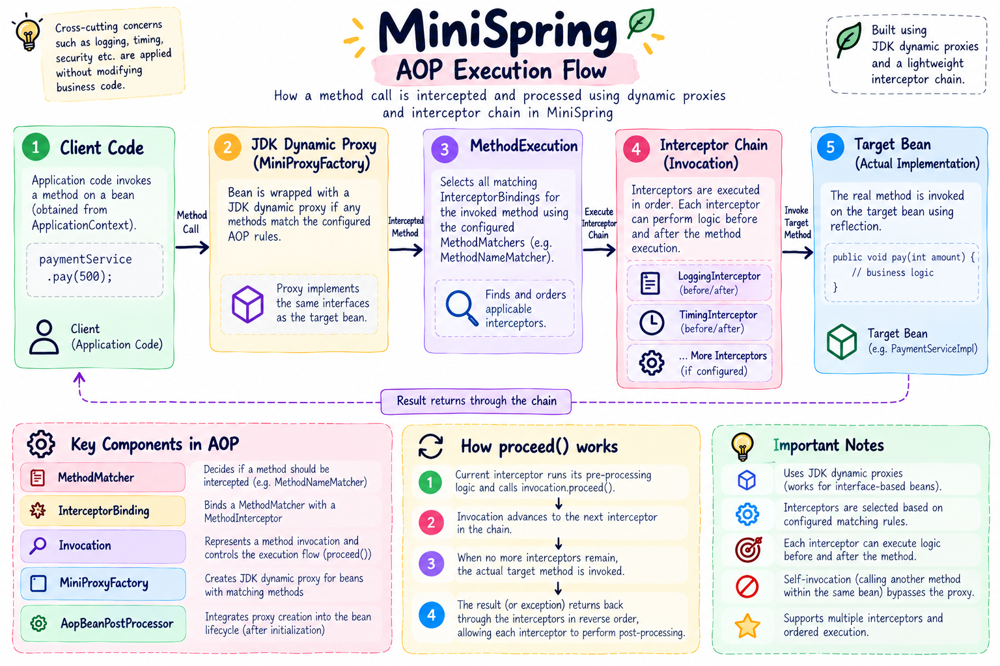

# MiniSpring

[](https://openjdk.org/)
[](https://maven.apache.org/)
[](https://github.com/meetanuragyadav/mini-spring-container/actions/workflows/build.yml)

**MiniSpring is a lightweight Java project that implements selected Spring-style dependency-injection, bean-lifecycle, event, and AOP concepts.** It demonstrates how a framework can discover components, describe them as metadata, construct dependency graphs, manage object lifecycles, and intercept interface method calls.

The project is built with Java 17, Maven, and JUnit 5. It is intended as a compact, testable reference implementation—not as a drop-in replacement for the Spring Framework or as a production dependency-injection library.

## Architecture at a glance



MiniSpring separates responsibilities across discovery, configuration, bean metadata, and runtime resolution. `ApplicationContext` coordinates startup; `Container` resolves and creates objects; lifecycle extensions and post-processors add behavior around creation.

## Features

- **Dependency injection:** constructor-based resolution, qualifiers, primary candidates, and deferred resolution with `Provider<T>`.
- **Component discovery:** `@Component`, `@Configuration`, and `@Bean` factory methods.
- **Bean management:** singleton and prototype scopes, definition metadata, circular-dependency detection, and singleton caching.
- **Lifecycle extension points:** initialization, destruction, aware callbacks, `BeanFactoryPostProcessor`, and `BeanPostProcessor`.
- **Conditional configuration:** environment properties and profiles.
- **Application events:** `@EventListener` discovery and synchronous event publication.
- **Aspect-oriented programming:** method matchers, interceptor bindings, ordered interceptor chains, logging and timing interceptors, and automatic proxying through a bean post-processor.
- **Automated tests:** JUnit 5 coverage for container behavior, lifecycle callbacks, event handling, proxy behavior, and AOP integration.

## Bean lifecycle



The container resolves a definition, creates an object through a constructor or factory method, invokes supported callbacks, applies post-processors, and then caches the processed reference when the bean uses singleton scope.

## AOP execution flow



A configured matcher selects interceptors for a method call. The interceptor chain wraps the target invocation, allowing cross-cutting behavior such as logging and timing to run without placing that code inside the business method.

## Requirements

- JDK 17 or newer
- Apache Maven 3.8 or newer

## Build and test

Run these commands from the repository root:

```bash
mvn clean verify
```

Run the general container example:

```bash
mvn package
java -jar target/mini-spring-container-0.1.0-SNAPSHOT.jar
```

Run the container-integrated AOP example:

```bash
java -cp target/classes com.minispring.demo.aopcontainer.AopContainerDemo
```

The AOP example configures logging and timing interceptors for `processPayment`, requests the service through its interface, and invokes the method through the generated proxy.

## Project structure

```text
src/
├── main/java/com/minispring/
│   ├── annotation/  Framework annotations
│   ├── aop/         Matchers, interceptors, invocation chain, proxy factory
│   ├── condition/   Profile and property conditions
│   ├── context/     ApplicationContext and Environment
│   ├── core/        Bean definitions, container, scopes, providers
│   ├── demo/        Runnable examples
│   ├── events/      Event registry, listener scanning, publisher
│   ├── lifecycle/   Lifecycle and processor contracts
│   └── scanner/     Classpath, component, and configuration scanning
└── test/java/       Unit and integration tests

docs/
├── architecture.md
├── usage.md
└── images/          README architecture diagrams
```

## Documentation

- [Architecture and Explaination](docs/architecture.md)
- [Build, run, configuration, and AOP examples](docs/usage.md)
## Design boundaries

MiniSpring intentionally implements a limited subset of Spring-style behavior:

- Bean definitions and singleton instances are keyed by class; separately named registrations of the same class and general name-based lookup are not supported.
- The classpath scanner is intentionally simple and is not designed to cover every packaging or class-loader scenario.
- Event dispatch is synchronous and currently matches the exact runtime event class.
- AOP uses JDK dynamic proxies, so proxied beans should be accessed through their interfaces. Class-based proxies are not implemented.
- A target's direct call to another method on `this` bypasses the proxy (self-invocation).
- `MethodNameMatcher` matches by method name, including overloaded methods with the same name.

These boundaries keep the implementation small enough to inspect while preserving the core mechanics demonstrated by the project.

## License

Distributed under the [MIT License](LICENSE).
