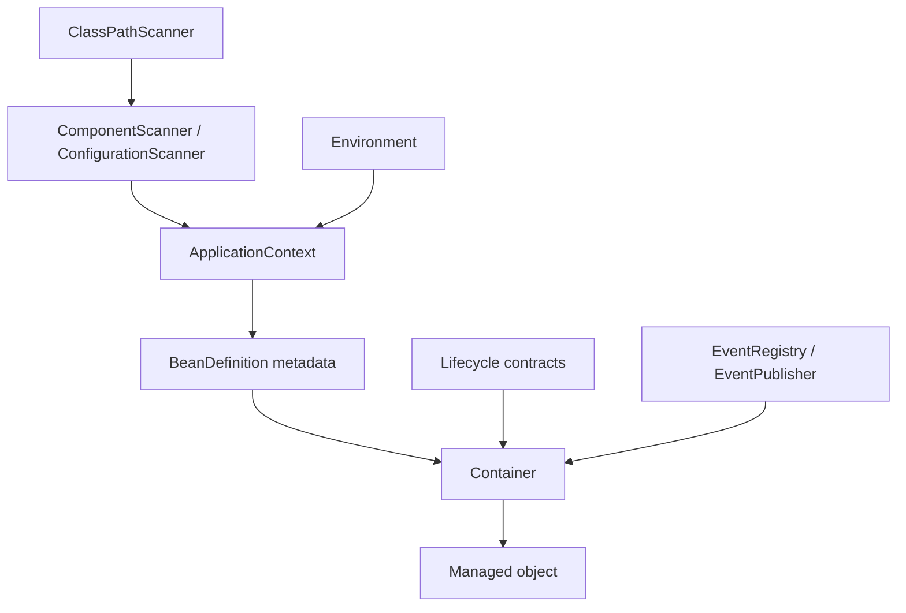

# MiniSpring Architecture Notes

This is a concise architecture map. For full explanations, diagrams, lifecycle details, and limitations, see [MINISPRING_INTERNALS.md](../MINISPRING_INTERNALS.md).

## Responsibility boundaries



### Discovery

- `ClassPathScanner`: finds loadable classes under a package.
- `ComponentScanner`: filters for `@Component`.
- `ConfigurationScanner`: finds `@Bean` methods in `@Configuration` classes.
- `BeanMethod`: holds a configuration class and factory method.

Scanners discover candidates; they do not create beans.

### Application orchestration

`ApplicationContext` builds definitions, evaluates conditions, registers eligible definitions, installs event infrastructure and processors, and exposes `getBean`, `publishEvent`, `getEnvironment`, and `close`.

### Metadata

`BeanDefinition` describes how a bean should be created and managed. It is not the runtime object.

Current fields include the class, scope, optional qualifier, primary flag, optional factory method, conditions, and bean name.

### Runtime container

`Container` performs candidate selection, constructor/factory-method invocation, dependency resolution, scope handling, lifecycle callbacks, post-processing, circular-dependency detection, singleton caching, and destruction.

## Resolution sequence

```mermaid
flowchart TD
    A[resolve(type, qualifier)] --> B[Find candidate definition]
    B --> C{Cached singleton?}
    C -- Yes --> D[Return cached instance]
    C -- No --> E{Type already in resolution path?}
    E -- Yes --> F[Report circular dependency]
    E -- No --> G[Create through constructor or factory method]
    G --> H[Aware callbacks]
    H --> I[beforeInitialization]
    I --> J[initialize if supported]
    J --> K[afterInitialization]
    K --> L{Singleton?}
    L -- Yes --> M[Cache result]
    L -- No --> N[Return uncached result]
    M --> O[Return result]
    N --> O
```

The active resolution stack is removed in a `finally` block so failed creation does not leave a stale resolution path.

## Important design boundaries

- Environment conditions are evaluated by `ApplicationContext`, not inside `Container.findCandidate`.
- Factory-method definitions use the same runtime dependency-resolution pipeline as constructor-based definitions.
- `BeanPostProcessor` may return a replacement object; the post-processed result is what gets cached for a singleton.
- `Provider<T>` defers resolution until `get()` is called.
- Event delivery is synchronous and currently matches the exact event runtime class.
- Bean definitions and singleton instances are keyed by class. Bean names are stored and supplied to aware callbacks, but a general name-based lookup system and duplicate same-class registrations are not implemented.
- Aware callbacks are MiniSpring's current lifecycle extension points; the project is not yet a complete Spring-compatible container.

## Lifecycle ordering

For the current implementation:

1. Create the object through its constructor or factory method.
2. Call `BeanNameAware.setBeanName`, if implemented.
3. Call `BeanResolverAware.setBeanResolver`, if implemented.
4. Call `ApplicationContextAware.setApplicationContext`, if implemented.
5. Run `BeanPostProcessor.beforeInitialization`.
6. Run `Initializable.initialize`, if implemented.
7. Run `BeanPostProcessor.afterInitialization`.
8. Cache the result if the scope is singleton.
9. Remove the type from the active resolution stack in `finally`.

This ordering is project-specific and is tested by the repository's integration tests.

## AOP extension point and current implementation

`AopBeanPostProcessor` uses `BeanPostProcessor.afterInitialization` to wrap eligible interface-based beans in JDK dynamic proxies. `MethodExecution` selects configured `InterceptorBinding` objects, and an `Invocation` advances the ordered interceptor chain. Class-based proxies are not implemented. Self-invocation bypasses the proxy, and consumers should request proxied beans through their interfaces.
