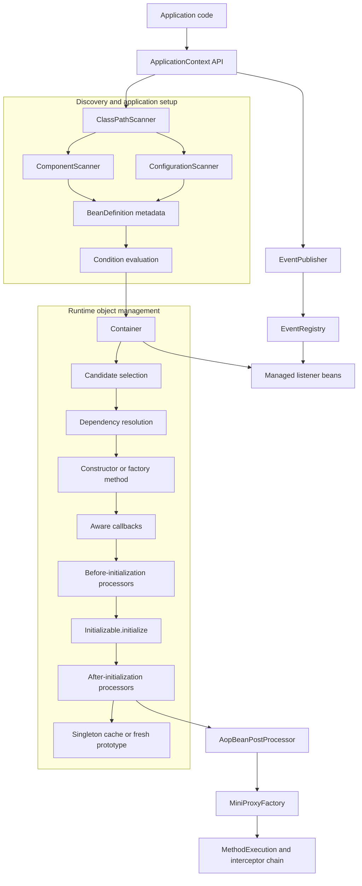
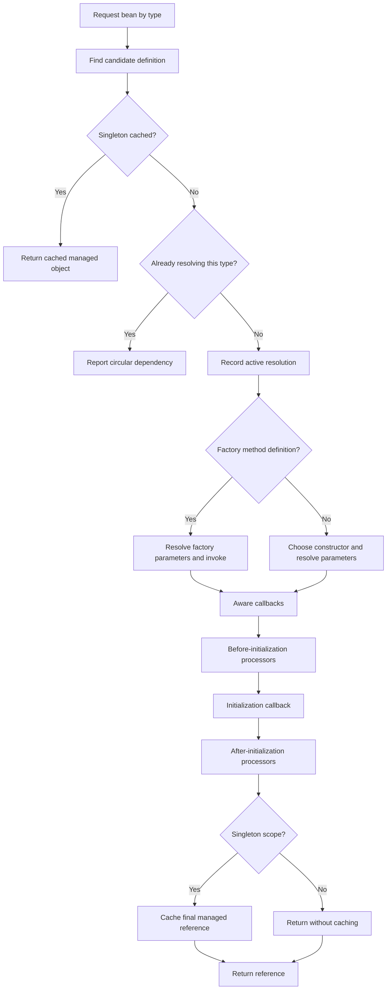
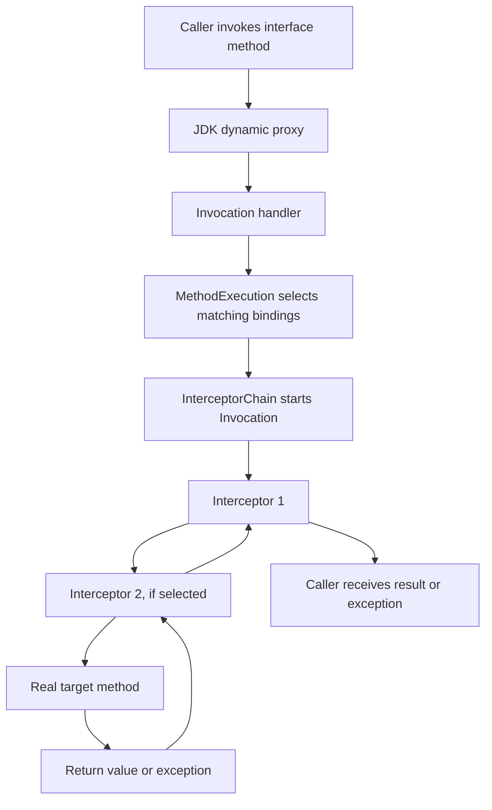
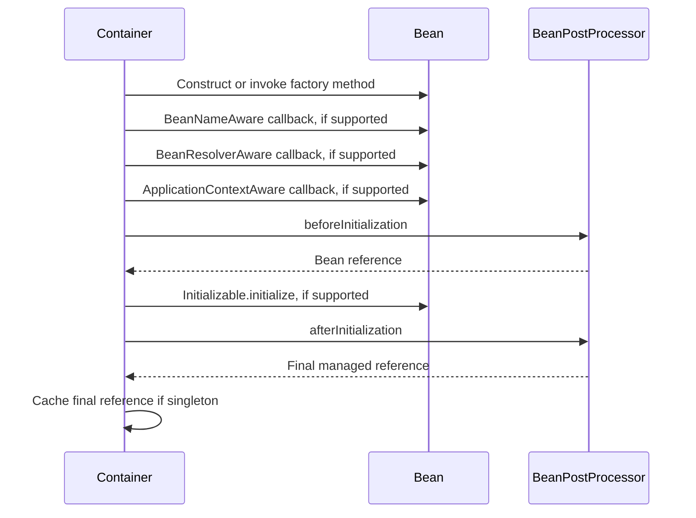
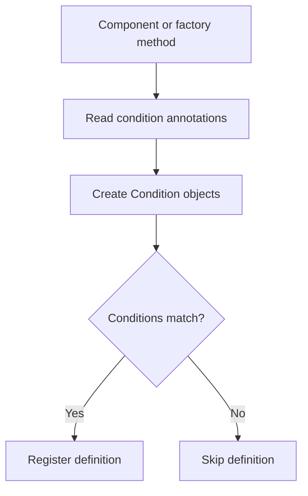
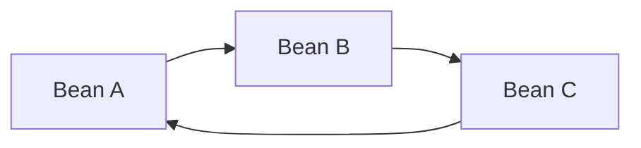
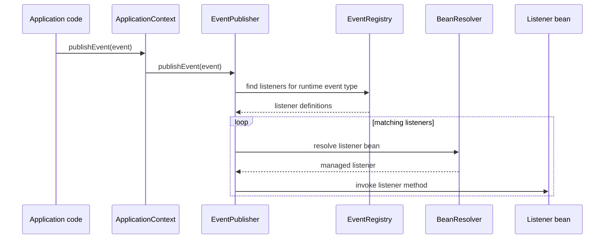
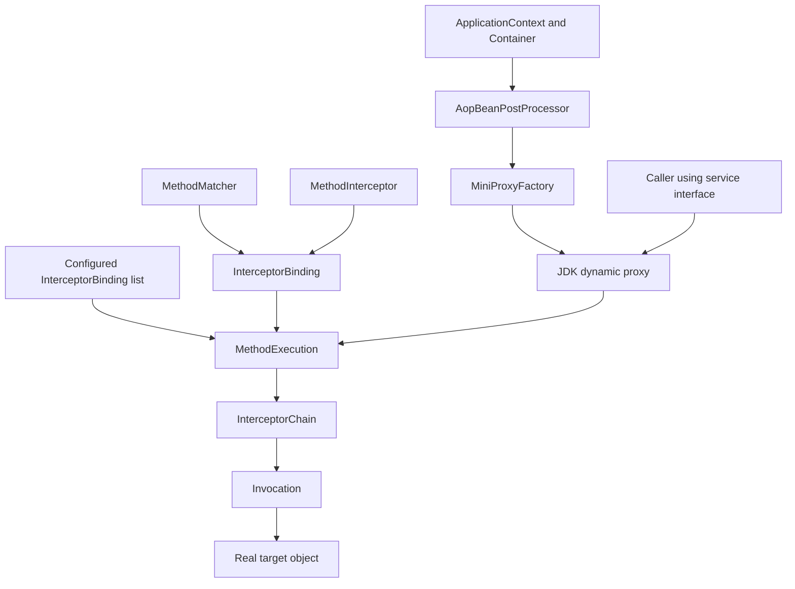
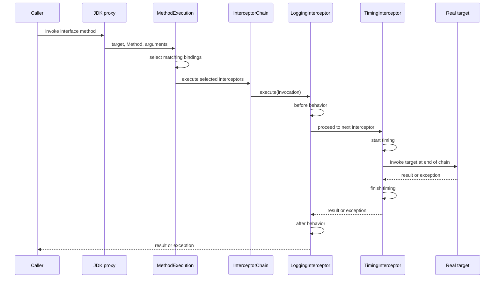

# MiniSpring — Architecture and Internal Design

MiniSpring is a lightweight Java dependency-injection container inspired by selected concepts from the Spring Framework. It demonstrates how component discovery, bean metadata, dependency resolution, lifecycle callbacks, application events, and aspect-oriented programming can work together.

This document is the detailed technical companion to the project's README. It explains the architecture, responsibilities of the major components, object-creation paths, runtime behavior, design decisions, examples, limitations, and potential extensions.

> **Scope:** MiniSpring is an educational framework implementation, not a drop-in replacement for Spring Framework. Its behavior and limitations are described explicitly throughout this document.

---

## Contents

1. [Project goals](#1-project-goals)
2. [Architecture at a glance](#2-architecture-at-a-glance)
3. [Package structure](#3-package-structure)
4. [Core concepts and terminology](#4-core-concepts-and-terminology)
5. [ApplicationContext](#5-applicationcontext)
6. [Scanning and registration](#6-scanning-and-registration)
7. [BeanDefinition and bean identity](#7-beandefinition-and-bean-identity)
8. [Container and dependency resolution](#8-container-and-dependency-resolution)
9. [Constructor and factory-method creation](#9-constructor-and-factory-method-creation)
10. [Scopes and lifecycle](#10-scopes-and-lifecycle)
11. [Post-processors and extension points](#11-post-processors-and-extension-points)
12. [Profiles, properties, and conditional registration](#12-profiles-properties-and-conditional-registration)
13. [Provider and circular dependencies](#13-provider-and-circular-dependencies)
14. [Application events](#14-application-events)
15. [Aware interfaces](#15-aware-interfaces)
16. [Aspect-oriented programming (AOP)](#16-aspect-oriented-programming-aop)
17. [End-to-end execution traces](#17-end-to-end-execution-traces)
18. [Testing strategy](#18-testing-strategy)
19. [Build, run, and verification](#19-build-run-and-verification)
20. [Known limitations](#20-known-limitations)
21. [Possible future extensions](#21-possible-future-extensions)
22. [Design summary](#22-design-summary)

---

## 1. Project goals

An application often consists of objects that depend on other objects. For example, an order service may need a payment gateway, a repository, and a notification service.

Without a container, application code constructs and connects those dependencies directly:

```java
PaymentGateway gateway = new StripeGateway();
OrderRepository repository = new JdbcOrderRepository();
OrderService service = new OrderService(gateway, repository);
```

This is perfectly valid Java. As the application grows, however, application code must repeatedly make decisions about:

- which implementation to instantiate;
- how to resolve nested dependencies;
- which objects should be shared;
- when initialization should happen;
- how to expose cross-cutting behavior;
- how to clean up managed resources.

MiniSpring centralizes these responsibilities. Application code requests a managed object, and the framework resolves and constructs the supported object graph.

```java
try (ApplicationContext context =
         new ApplicationContext("com.example.application")) {

    OrderService service = context.getBean(OrderService.class);
    service.createOrder();
}
```

The exact API and configuration options depend on the current implementation. The example illustrates the intended usage pattern: application code works with a managed service instead of manually constructing every dependency.

### Main capabilities

- Annotation-based component discovery.
- Configuration classes and `@Bean` factory methods.
- Constructor dependency injection.
- Type-based candidate selection, qualifiers, and primary candidates.
- Singleton and prototype scopes.
- Lifecycle callbacks and bean post-processors.
- Profile- and property-based conditional registration.
- Synchronous application events.
- Aware interfaces for selected container capabilities.
- AOP through configured method matchers, interceptors, and JDK dynamic proxies.
- Tests and runnable examples for the implemented behavior.

The design prioritizes separation of responsibilities. Discovery, metadata, resolution, lifecycle processing, and method interception are separate concerns.

---

## 2. Architecture at a glance

### 2.1 High-level component architecture



The diagram groups the implementation into two broad responsibilities:

1. **Application setup:** find candidates, interpret annotations, build metadata, evaluate conditions, and register definitions.
2. **Runtime management:** resolve requested types, create objects, apply lifecycle hooks and processors, and return the managed reference.

The event system and AOP use the core container instead of creating a separate object-management system.

### 2.2 Core responsibility boundaries

| Component | Primary responsibility | Deliberately does not own |
|---|---|---|
| `ClassPathScanner` | Discover loadable classes under a package | Bean creation |
| `ComponentScanner` | Identify component classes | Dependency resolution |
| `ConfigurationScanner` | Find supported `@Bean` methods | Invoking every factory method |
| `Condition` implementations | Decide whether metadata satisfies a condition | Registering beans themselves |
| `ApplicationContext` | Coordinate application setup and expose the application API | The low-level resolution algorithm |
| `BeanDefinition` | Describe how a bean is registered and created | The runtime instance |
| `Container` | Select candidates, resolve dependencies, create objects, and manage lifecycle | Package scanning |
| `BeanPostProcessor` | Inspect or replace a bean around initialization | Whole-application orchestration |
| Event infrastructure | Store listener metadata and dispatch events | Constructing beans independently |
| AOP infrastructure | Select interceptors and route interface calls through them | General-purpose class proxying |

This separation keeps the implementation easier to reason about and test. A scanner can change without rewriting the container's constructor-resolution logic, and a new post-processor can add behavior without duplicating the bean-creation pipeline.

### 2.3 Main runtime flows

**Bean creation**



**AOP method execution**



The AOP path is part of the bean lifecycle because the proxy is created by a bean post-processor. The caller normally does not need to create or manage that proxy manually.

---

## 3. Package structure

The framework code lives under `src/main/java/com/minispring/`. The exact file list may evolve, but the main packages are organized by responsibility.

```text
src/main/java/com/minispring/
├── annotation/
│   ├── Bean.java
│   ├── BeanScope.java
│   ├── Component.java
│   ├── Configuration.java
│   ├── Inject.java
│   ├── Primary.java
│   ├── Qualifier.java
│   ├── Profile.java
│   ├── ConditionalOnProperty.java
│   └── EventListener.java
├── condition/
│   ├── Condition.java
│   ├── ProfileCondition.java
│   └── PropertyCondition.java
├── context/
│   ├── ApplicationContext.java
│   └── Environment.java
├── core/
│   ├── BeanDefinition.java
│   ├── BeanResolver.java
│   ├── Container.java
│   ├── Provider.java
│   └── Scope.java
├── events/
│   ├── EventListenerDefinition.java
│   ├── EventListenerMethodScanner.java
│   ├── EventRegistry.java
│   ├── EventPublisher.java
│   └── EventDispatchException.java
├── lifecycle/
│   ├── Initializable.java
│   ├── Destroyable.java
│   ├── BeanPostProcessor.java
│   ├── BeanFactoryPostProcessor.java
│   ├── BeanNameAware.java
│   ├── BeanResolverAware.java
│   └── ApplicationContextAware.java
├── aop/
│   ├── MethodInterceptor.java
│   ├── Invocation.java
│   ├── InterceptorChain.java
│   ├── MethodMatcher.java
│   ├── MethodNameMatcher.java
│   ├── InterceptorBinding.java
│   ├── MethodExecution.java
│   ├── MiniProxyFactory.java
│   └── AopBeanPostProcessor.java
└── demo/
    └── Runnable examples
```

Use the actual repository tree as the source of truth if file names change.

### Package guide

| Package | Responsibility |
|---|---|
| `annotation` | Runtime annotations that declare component, injection, configuration, scope, condition, or listener metadata |
| `condition` | Reusable condition checks against the environment |
| `context` | Application setup, environment, public entry point, and orchestration |
| `core` | Bean definitions, resolution, scopes, provider abstraction, and runtime management |
| `lifecycle` | Contracts for initialization, destruction, post-processing, and awareness callbacks |
| `events` | Listener metadata, registry, publisher, and dispatch errors |
| `aop` | Method matching, interceptor execution, JDK proxy creation, and automatic bean wrapping |
| `demo` | Small applications that demonstrate framework behavior |

The demo package is useful both as documentation and as a quick manual smoke test. Framework internals should remain in their infrastructure packages rather than being mixed with examples.

---

## 4. Core concepts and terminology

### 4.1 Bean

A **bean** is an object managed by MiniSpring. The container is responsible for creating it through a supported creation path, applying lifecycle behavior, and managing it according to its scope.

An arbitrary Java object is not automatically a bean merely because it exists in memory. It participates in MiniSpring's lifecycle when it is created or registered through the supported framework paths.

### 4.2 Bean definition

A `BeanDefinition` describes a bean before the instance exists. It contains metadata used during registration and creation, such as the bean class, scope, qualifiers, primary status, conditions, bean name, and optional factory method.

The definition is metadata; the bean is the runtime object.

### 4.3 Dependency injection

**Dependency injection** means that a class declares what it needs and the container supplies those dependencies. In MiniSpring, the main supported path is constructor injection.

```java
public class CheckoutService {
    private final PaymentService paymentService;

    public CheckoutService(PaymentService paymentService) {
        this.paymentService = paymentService;
    }
}
```

The service describes its requirement without choosing and constructing a particular `PaymentService` implementation itself.

### 4.4 Application context versus container

The `ApplicationContext` coordinates setup and exposes the application-facing API. The `Container` performs runtime resolution and object management.

The distinction matters because scanning and annotation interpretation belong to setup, while selecting a bean and constructing it belong to runtime resolution.

### 4.5 Target, proxy, and interceptor

These terms are used by the AOP subsystem:

- **Target:** the actual object containing business logic.
- **Proxy:** an intermediary object that receives interface calls and forwards them through the configured AOP execution path.
- **Interceptor:** an object that runs behavior around a method call and decides whether to continue the invocation.
- **Matcher:** a rule that decides whether a method qualifies for an interceptor.
- **Invocation:** the context of one particular method call, including its target, method, arguments, and place in the chain.

---

## 5. `ApplicationContext`

**Source:** `src/main/java/com/minispring/context/ApplicationContext.java`

`ApplicationContext` is the setup coordinator and public entry point. It prepares definitions and infrastructure before application code requests managed objects.

### 5.1 Setup phases

#### Phase 1 — Discovery

The context asks `ClassPathScanner` to find loadable classes under the configured package. Specialized scanners interpret those classes as components or configuration classes.

Discovery identifies candidates; it does not mean every candidate is immediately instantiated.

#### Phase 2 — Build definitions

The context turns discovered components and `@Bean` methods into `BeanDefinition` objects. Metadata can include scope, qualifiers, primary status, bean name, conditions, and the factory method where applicable.

#### Phase 3 — Conditional registration

The context evaluates the conditions associated with each definition. A definition whose conditions do not match is skipped rather than registered for later use.

#### Phase 4 — Infrastructure registration

The context installs infrastructure needed for supported features, including event publishing and listener metadata. AOP is integrated through a `BeanPostProcessor` when AOP bindings are supplied.

#### Phase 5 — Factory post-processors

Eligible `BeanFactoryPostProcessor` implementations are resolved and invoked with the container. This extension point operates on container metadata before normal application bean use.

#### Phase 6 — Bean post-processors

Eligible `BeanPostProcessor` instances are resolved and added to the container's processor sequence. Beans created later pass through the registered processors.

### 5.2 Public responsibilities

The context's public API includes operations for:

- resolving a bean by type;
- resolving a bean by type and qualifier;
- publishing an application event;
- accessing the environment;
- closing the context and initiating managed singleton destruction.

The context delegates actual bean resolution to the container instead of implementing a second resolution algorithm.

### 5.3 Environment timing

The `Environment` is used during context setup. Profiles and properties intended to influence registration should be configured before constructing the context. Changing an environment value after registration does not automatically rebuild definitions that were previously skipped or registered.

---

## 6. Scanning and registration

MiniSpring separates finding classes from interpreting their annotations.

### 6.1 `ClassPathScanner`

The classpath scanner discovers loadable `.class` files under the requested package path. It is a deliberately small implementation intended to make the discovery mechanism understandable.

### 6.2 `ComponentScanner`

The component scanner filters discovered classes to identify those marked with `@Component`.

### 6.3 `ConfigurationScanner`

The configuration scanner identifies `@Configuration` classes and supported `@Bean` methods. Factory-method metadata is represented separately so the container can invoke the method later, when the bean is requested.

### 6.4 Why discovery and creation are separate

Separating discovery from construction gives the context an opportunity to:

1. identify candidates;
2. build definitions;
3. evaluate conditions;
4. register only eligible definitions;
5. defer ordinary bean construction until resolution.

This avoids turning the scanning process into a large loop that eagerly constructs every discovered class.

### 6.5 Current scanning limitation

The scanner is a simple directory-based implementation. It is not a complete classpath scanner for every nested-JAR layout, Java module arrangement, or custom class-loader setup.

---

## 7. `BeanDefinition` and bean identity

**Source:** `src/main/java/com/minispring/core/BeanDefinition.java`

A definition describes how a bean should be registered and created. It is kept separate from the runtime object so the context and container can make decisions before creation.

The definition currently records metadata such as:

- bean class;
- scope;
- optional qualifier;
- primary flag;
- optional factory method;
- attached conditions;
- bean name.

### 7.1 Candidate selection

The container considers definitions whose registered bean class is assignable to the requested type. This permits an application to request an interface while the registered definition describes a concrete implementation.

When more than one candidate exists, the supported selection rules consider qualifiers and a unique primary candidate. Missing or ambiguous resolution produces an error rather than silently choosing an arbitrary implementation.

### 7.2 Bean-name limitation

Component names are derived from component class names, while `@Bean` definitions use the factory method name. These names can be supplied through `BeanNameAware`.

However, the current definition and singleton maps are keyed by `Class<?>`, not by bean name. Consequently, MiniSpring does not currently support two independent registrations of the same class distinguished only by different names, nor does it provide a full general-purpose name-based lookup system. Bean names are metadata for supported lifecycle behavior, not the primary identity key.

---

## 8. `Container` and dependency resolution

**Source:** `src/main/java/com/minispring/core/Container.java`

The container is the runtime resolution engine. It owns definition lookup, candidate selection, dependency resolution, object construction, lifecycle processing, singleton caching, and circular-resolution detection.

### 8.1 Important internal state

| State | Purpose |
|---|---|
| `definitions` | Registered definitions keyed by bean class |
| `instances` | Cached singleton managed objects keyed by bean class |
| `resolutionStack` | Active dependency-resolution path |
| `postProcessors` | Bean post-processors applied around initialization |
| `singletonCreationOrder` | Order used for reverse-order singleton destruction |
| `applicationContext` | Context reference supplied to context-aware beans when available |

The container also exposes itself through the narrower `BeanResolver` abstraction. This lets beans request the resolution capability without needing to depend directly on the concrete container class.

### 8.2 Resolution algorithm

A normal resolution follows this conceptual sequence:

1. Find a definition matching the requested type and optional qualifier.
2. If a singleton is already cached, return the cached managed reference.
3. Check whether the requested type is already on the active resolution stack.
4. If it is already active, report a circular dependency.
5. Record the type as currently being resolved.
6. Construct the object using a factory method or constructor.
7. Apply aware callbacks.
8. Run before-initialization processors.
9. Invoke `Initializable.initialize()` if supported.
10. Run after-initialization processors.
11. Cache the final managed reference if the scope is singleton.
12. Return the reference and remove the active type from the resolution stack in a `finally` path.

The final managed reference matters. A post-processor may return a wrapper or proxy, so the object exposed to callers may differ from the raw object constructed by the constructor or factory method.

### 8.3 Why use `finally` for resolution cleanup?

If creation throws an exception, the active resolution marker must still be removed. Otherwise a failed request could leave stale state and make a later request look circular even though the later request is independent.

### 8.4 Constructor selection and injection

For class-backed definitions, the container selects a supported constructor and resolves its parameters through the container. A constructor annotated with `@Inject` is preferred by the implementation's selection logic; the supported fallback behavior applies when there is no explicitly selected constructor.

Constructor injection keeps required dependencies visible in the class's public construction contract. It also makes dependency graphs easier to test.

### 8.5 Concurrency boundary

The current project does not claim that concurrent bean creation is fully thread-safe. The AOP invocation chain has tests for concurrent calls, but that does not establish that every container operation is safe under concurrent resolution. Thread-safe singleton creation, atomic registration, and safe shutdown coordination would require a separate design and test effort.

---

## 9. Constructor and factory-method creation

MiniSpring supports more than one way to create a bean, but both creation paths converge on the same lifecycle pipeline.

### 9.1 Constructor-backed bean

For a class-backed definition:

1. select a constructor;
2. resolve constructor parameters;
3. invoke the constructor;
4. apply awareness callbacks;
5. apply post-processors and initialization;
6. cache the final reference if singleton-scoped.

### 9.2 `@Bean` factory-method bean

For a factory-method definition:

1. resolve the configuration-class instance if the factory method is non-static;
2. resolve the factory method's parameters;
3. invoke the factory method;
4. apply the same awareness and lifecycle pipeline used for constructor-created beans;
5. cache the final reference if singleton-scoped.

The shared lifecycle is an important invariant. Beans should not skip post-processing merely because they were created by a factory method rather than a constructor.

### 9.3 Factory-method example

A configuration class can conceptually provide a dependency as follows:

```java
@Configuration
public class PaymentConfiguration {
    @Bean
    public PaymentService paymentService() {
        return new PaymentServiceImpl();
    }
}
```

The scanner records the factory method as metadata. The container invokes it when resolving the bean and then processes the returned object through the supported lifecycle.

The example illustrates the concept; use the annotations and method signatures actually present in the repository when writing application code.

---

## 10. Scopes and lifecycle

MiniSpring currently supports singleton and prototype scopes.

### 10.1 Singleton scope

The first successful resolution creates and processes the object. The final managed reference is stored in the singleton cache. Subsequent resolutions of that registered class return the cached reference.

```text
resolve(Service) -> Service instance #1
resolve(Service) -> Service instance #1
resolve(Service) -> Service instance #1
```

For an AOP-enabled bean, the final managed reference may be a proxy. It is that processed reference which should be reused for the singleton.

### 10.2 Prototype scope

A prototype is created on each resolution and is not stored in the singleton cache.

```text
resolve(Service) -> Service instance #1
resolve(Service) -> Service instance #2
resolve(Service) -> Service instance #3
```

A singleton that receives a prototype through ordinary constructor injection retains the prototype instance it received during its own creation. The field is not automatically replaced with a new prototype on every use.

### 10.3 Lifecycle order

The current lifecycle sequence is:



The order is significant. A post-processor may inspect or replace the object, and the after-initialization result is the reference returned by the container.

### 10.4 Shutdown and destruction

`ApplicationContext.close()` delegates to the container's singleton-destruction mechanism. The container tracks singleton creation order and destroys managed singleton objects in reverse order. This generally allows dependent resources created later to be closed before the objects they depend on.

Prototype objects are not retained in the singleton destruction list and are not managed through the same shutdown mechanism.

---

## 11. Post-processors and extension points

MiniSpring exposes two different post-processing stages.

### 11.1 `BeanFactoryPostProcessor`

A factory post-processor works with container metadata before ordinary application beans are requested. This extension point is intended for changing or inspecting definitions and other factory-level information.

### 11.2 `BeanPostProcessor`

A bean post-processor works with an individual object around initialization. It can inspect the object or return a different reference.

The current pipeline has:

- `beforeInitialization`;
- the optional `Initializable.initialize()` callback;
- `afterInitialization`.

AOP uses the after-initialization stage to wrap eligible objects in proxies.

### 11.3 Why this extension point matters

Without post-processors, every feature that needs to change bean behavior would have to be built directly into the core creation algorithm. With a post-processor, the container can keep its generic lifecycle while features such as proxying are implemented as separate infrastructure.

The extension point also creates responsibility: a processor that replaces an object must return a reference compatible with the types consumers expect. MiniSpring's AOP processor uses interface proxies, so this compatibility boundary is especially important.

---

## 12. Profiles, properties, and conditional registration

`Environment` stores active profiles and string properties. Conditions evaluate this environment before the context registers a bean definition.

### 12.1 Profiles

A profile condition matches when the configured active profiles satisfy the profile annotation's rule.

### 12.2 Properties

A property condition compares a property's actual value with the configured expected value.

### 12.3 Registration flow



This is a registration decision, not simply a decision to ignore an object after creating it. A definition whose conditions do not match is skipped.

Configure the environment before creating the context if profiles or properties should affect initial registration.

---

## 13. Provider and circular dependencies

### 13.1 Detecting cycles

Consider a constructor dependency graph:



While resolving A, the container may begin resolving B, then C, and eventually encounter A again. The `resolutionStack` records the active path so the container can report the cycle rather than recursing indefinitely.

This detection addresses constructor-resolution cycles within the supported model. It is not a general dependency-graph analysis engine.

### 13.2 Deferred resolution with `Provider<T>`

A provider defers resolving a dependency until the provider is used.

```text
Direct dependency:
    Construct A -> resolve B immediately

Provider dependency:
    Construct A -> provide Provider<B>
    Later:
        provider.get() -> resolve B
```

Deferring a dependency can break a construction-time cycle when the dependency is genuinely safe to resolve later. It does not automatically make every circular design sound.

---

## 14. Application events

The event subsystem provides synchronous publication and listener dispatch through the managed container.

### 14.1 Components

| Component | Responsibility |
|---|---|
| `EventListenerMethodScanner` | Finds and validates methods annotated with `@EventListener` |
| `EventListenerDefinition` | Stores listener bean class, method, and event type metadata |
| `EventRegistry` | Maps event types to listener definitions |
| `EventPublisher` | Resolves listener beans and invokes listener methods |
| `EventDispatchException` | Represents a dispatch failure |

### 14.2 Event flow



### 14.3 Current event semantics

- Dispatch is synchronous.
- Matching uses the event's exact runtime class.
- Listener methods must be instance methods with one supported non-primitive parameter and `void` return type.
- A dispatch failure is wrapped in `EventDispatchException` and stops the dispatch loop.
- A listener bean resolved for multiple listener methods on the same class is reused during a single dispatch.
- Discovery currently scans eligible component classes, not every arbitrary object returned from a factory method.

The implementation does not include an asynchronous queue, retries, durable delivery, an event broker, or superclass/interface event matching.

---

## 15. Aware interfaces

Aware callbacks provide selected framework capabilities to objects that implement the relevant interfaces.

| Interface | Capability provided | Typical use |
|---|---|---|
| `BeanNameAware` | The registered bean name metadata | Diagnostics or name-sensitive framework behavior |
| `BeanResolverAware` | The `BeanResolver` abstraction | Genuine dynamic lookup at runtime |
| `ApplicationContextAware` | The owning application context | Access to broader context-level capabilities |

Constructor injection should remain the default for ordinary application dependencies. Aware interfaces are useful when a bean genuinely needs the specific framework capability they provide, but direct context access increases coupling.

`BeanResolverAware` is a MiniSpring-specific interface. `ApplicationContextAware` is also MiniSpring's own implementation of this general style of callback; the existence of a similarly named interface in Spring does not make the two frameworks API-compatible.

A bean created through a bare `Container` without an owning context does not have the same guarantee of receiving a non-null application context as a bean created through `ApplicationContext`.

---

## 16. Aspect-oriented programming (AOP)

MiniSpring's AOP subsystem adds behavior around selected interface method calls without requiring that behavior to be copied into every business class.

Typical cross-cutting behavior includes logging, timing, auditing, and authorization checks. The implementation is built from small pieces: method matchers, interceptor bindings, interceptors, invocation state, an execution chain, a proxy factory, and a bean post-processor.

### 16.1 The problem AOP addresses

Suppose several services need the same logging or timing code. Putting that code in every service duplicates logic and mixes infrastructure behavior with business behavior.

AOP separates two questions:

1. **Where should the extra behavior apply?**
2. **What should the extra behavior do?**

A matcher answers the first question. An interceptor answers the second. A binding connects them, and the proxy routes method calls into the configured execution mechanism.

### 16.2 AOP architecture



### 16.3 `MethodMatcher`

The `MethodMatcher` interface answers whether a reflected Java `Method` matches a selection rule.

`MethodNameMatcher` is the simple implementation that compares the method name. A name-only matcher selects every overload with that name; it does not distinguish parameter lists.

This interface separates selection from behavior. More precise matchers could be added without changing how the interceptor chain executes.

### 16.4 `InterceptorBinding`

An `InterceptorBinding` pairs one matcher with one interceptor.

Conceptually:

```text
MethodMatcher("pay") + LoggingInterceptor
                       |
                       v
               InterceptorBinding
```

A binding says which extra behavior should be used for calls that match the rule. Multiple bindings may match the same method, in which case the configured ordering determines the chain order.

### 16.5 `MethodInterceptor`

The interceptor contract is conceptually:

```java
public interface MethodInterceptor {
    Object execute(Invocation invocation) throws Throwable;
}
```

An interceptor can perform work before continuing, call `invocation.proceed()`, inspect the result, handle an exception, or intentionally return a result without continuing.

For example, an around-style interceptor can be represented as:

```java
public Object execute(Invocation invocation) throws Throwable {
    beforeCall();

    try {
        Object result = invocation.proceed();
        afterSuccess(result);
        return result;
    } catch (Throwable error) {
        afterFailure(error);
        throw error;
    }
}
```

This is an illustrative shape. The actual implementation should be consulted for the exact behavior and message format of the project's concrete interceptors.

An interceptor should preserve the result and exception semantics unless changing them is an intentional part of its contract.

### 16.6 `Invocation`

An `Invocation` represents one method execution attempt. It holds the target object, reflected method, arguments, selected interceptors, and the current position in the chain.

Its `proceed()` method has two cases:

1. If another interceptor remains, invoke that interceptor with a continuation positioned at the next step.
2. If no interceptors remain, invoke the real target method.

The implementation unwraps `InvocationTargetException` so the target's underlying exception can propagate through the chain rather than being obscured by the reflection wrapper.

The continuation design avoids a single shared mutable chain cursor. Each nested step has its own position, which makes the flow easier to reason about when multiple method calls overlap.

The implementation also enforces a single-use continuation: calling `proceed()` more than once on the same `Invocation` throws `IllegalStateException`. An interceptor may still deliberately short-circuit by not calling `proceed()`.

### 16.7 `InterceptorChain`

The chain owns the selected interceptor sequence and starts an invocation at the beginning. It stores an immutable copy of the supplied list, preventing later changes to the original list from silently altering the configured sequence.

The chain is responsible for starting execution; the invocation is responsible for advancing from its current position.

### 16.8 `MethodExecution`

`MethodExecution` connects method selection with execution:

1. Receive the target, reflected method, and arguments.
2. Evaluate the configured matchers against the method.
3. Collect matching interceptors in binding order.
4. Build/start the interceptor chain for that method call.
5. Return the result or propagate the exception.

A method with no matching interceptors can still execute normally through an empty chain.

### 16.9 `MiniProxyFactory`

The proxy factory creates a JDK dynamic proxy for one or more interfaces. The proxy's invocation handler receives calls and forwards business-interface methods to `MethodExecution`.

The factory validates the target and interface types, including that the target implements each requested interface. It also defines explicit behavior for basic `Object` methods such as `equals`, `hashCode`, and `toString`.

A JDK dynamic proxy implements interfaces; it does not subclass the concrete target class. As a result, callers should access a proxied bean through a supported interface. Concrete implementation-class injection or lookup is not generally compatible with this proxy strategy.

### 16.10 `AopBeanPostProcessor`

The AOP post-processor integrates proxy creation with normal bean lifecycle processing.

At a high level, it:

1. leaves the bean unchanged when no bindings are configured;
2. leaves null values unchanged;
3. skips existing JDK dynamic proxies;
4. inspects the interfaces implemented by the bean, including inherited interfaces;
5. checks whether an interface method matches a configured binding;
6. returns a proxy for eligible beans;
7. returns the original bean when no applicable binding exists.

The processor uses the after-initialization extension point, so proxying does not require a separate object-creation algorithm.

### 16.11 AOP method-call sequence



The diagram shows the nested-call principle: execution enters interceptors in configured order and returns through them in reverse order.

### 16.12 AOP configuration and container integration

AOP bindings are supplied to the context. When bindings are present, the context registers the AOP bean post-processor. During bean creation, the processor checks whether a bean's interfaces expose methods that match the configured rules. Eligible beans are returned as proxies, and consumers receive the processed reference through normal dependency resolution.

This design means that the container manages AOP-enabled beans like other beans. Application code does not need to manually wrap every dependency.

### 16.13 AOP limitations

- **Interface-based proxies:** class-based proxies are not implemented.
- **Self-invocation:** a target method that directly calls another method on `this` bypasses the proxy, so the internal call does not pass through the interceptor chain.
- **Name-only matching:** every overload with a matching method name is selected.
- **Explicit configuration:** the current design uses configured bindings; it does not provide the full annotation and pointcut-expression model of Spring AOP.
- **Existing proxies:** the processor skips existing JDK dynamic proxies as a simple safeguard; it does not implement a general proxy-composition policy.
- **No full Spring compatibility:** proxy selection, ordering, lifecycle interactions, and supported pointcuts are limited to the features implemented in this repository.

### 16.14 What the AOP tests should establish

A useful AOP test suite should cover behavior at more than one layer:

- chain order and short-circuit/continuation semantics;
- arguments, return values, primitive values, and `void` methods;
- target exceptions and checked exceptions declared by interfaces;
- repeated continuation protection;
- multiple interfaces and basic proxy `Object` methods;
- concurrent invocation behavior;
- unmatched methods and overloaded methods;
- integration with `ApplicationContext`;
- constructor injection of a proxied dependency;
- factory-method-created beans;
- singleton proxy identity.

Passing tests demonstrate the specific scenarios they execute. They do not imply full Spring AOP compatibility or prove every possible proxy combination.

---

## 17. End-to-end execution traces

### 17.1 Resolving a normal singleton

Assume `CheckoutService` depends on `PaymentService`.

1. Application code asks the context for `CheckoutService`.
2. The context delegates to the container.
3. The container finds the `CheckoutService` definition.
4. If the singleton is already cached, the cached managed object is returned.
5. Otherwise, the container begins resolving `CheckoutService` and records the active type.
6. It selects the constructor and resolves its `PaymentService` parameter.
7. The container creates and processes `PaymentService` as needed.
8. The constructor receives the resulting managed reference.
9. The container creates `CheckoutService`, runs its lifecycle pipeline, and caches the final reference if singleton-scoped.
10. The context returns the managed service.

This trace shows that dependency resolution is recursive: resolving one bean may require resolving several other beans first.

### 17.2 Resolving an AOP-enabled singleton

The creation path is similar, with one important difference:

1. The container constructs the raw target.
2. The target passes through awareness and initialization callbacks.
3. `AopBeanPostProcessor` checks the target's interfaces and configured bindings.
4. If a method matches, the processor returns a JDK proxy.
5. The container caches the final managed reference for a singleton.
6. A dependent service receives the proxy reference through constructor injection.
7. Calls made through the interface enter the interceptor chain.

The caller does not need to know how the proxy was created. The lifecycle pipeline ensures the processed reference is the one exposed by the container.

### 17.3 Publishing an event

1. Application code calls `ApplicationContext.publishEvent(event)`.
2. The context delegates to the event publisher.
3. The publisher asks the registry for listeners matching the event's exact runtime class.
4. For each listener definition, the publisher resolves the listener bean through the resolver.
5. The publisher invokes the listener method.
6. Dispatch completes synchronously or fails with the supported dispatch exception.

Because dispatch is synchronous, listener work occurs on the publishing call path. There is no built-in queue or asynchronous retry mechanism.

---

## 18. Testing strategy

Tests are part of the design documentation: they state which observable behavior the implementation intends to preserve.

### 18.1 Core and lifecycle tests

Core tests should exercise definition registration, candidate selection, constructor injection, scopes, circular dependency handling, factory methods, lifecycle callback ordering, and singleton destruction.

### 18.2 Event tests

Event tests should cover listener method validation, registration, exact event-type matching, synchronous dispatch, managed listener resolution, and failure behavior.

### 18.3 AOP tests

AOP unit tests should isolate the matcher, invocation, chain, and proxy behavior. Integration tests should verify that AOP still works when a bean is created through the context, injected into another bean, or produced by a factory method.

### 18.4 Run tests

From the project root:

```bash
mvn test
```

For a clean build and full verification lifecycle:

```bash
mvn clean verify
```

A successful test run confirms the assertions in the current suite. It is not a proof of compatibility with the full Spring Framework.

---

## 19. Build, run, and verification

### Requirements

- JDK 17 or a compatible Java 17 toolchain.
- Maven.
- A terminal opened at the project root.

### Verify

```bash
mvn clean verify
```

### Package

```bash
mvn package
```

### Run the packaged application

The runnable JAR name depends on the Maven artifact configuration. If the build produces the documented artifact, run:

```bash
java -jar target/mini-spring-container-0.1.0-SNAPSHOT.jar
```

If the JAR is not executable or its name differs, use the repository's Maven configuration and demo instructions as the source of truth.

### Useful final checks before a release

```bash
git status
git diff --check
git diff --stat
```

Check that the README, architecture diagrams, source tree, and documented commands match the actual repository. Run the complete test suite before creating a release commit.

---

## 20. Known limitations

The following are deliberate scope boundaries of the current implementation.

| Area | Current limitation |
|---|---|
| Bean identity | Definitions and singleton instances are keyed by class; independent same-class named registrations are unsupported |
| Bean names | Used as metadata for aware callbacks, not as a complete name-based lookup system |
| Classpath scanning | Simple scanner; not robust for every JAR, module, or class-loader arrangement |
| Concurrent creation | No general guarantee of thread-safe concurrent bean creation |
| Dependency selection | A small set of constructor, qualifier, and primary-selection rules |
| Prototype destruction | Prototype objects are not tracked in the singleton destruction list |
| Events | Synchronous exact-runtime-class dispatch; no asynchronous queue, retries, or broker |
| Listener discovery | Scans eligible component classes, not every possible factory-produced object |
| AOP proxying | JDK interface proxies; no class-based proxy implementation |
| AOP matching | Method-name matcher matches all overloads with that name |
| AOP self-invocation | Calls made directly on the target's `this` reference bypass the proxy |
| Proxy composition | Existing JDK proxies are skipped rather than handled through a general composition policy |
| Framework compatibility | Educational subset; not a drop-in replacement for Spring Framework |

These limitations should be treated as explicit design boundaries, not hidden assumptions. Any extension should come with tests and an update to this document.

---

## 21. Possible future extensions

The following are potential improvements, not claims about current functionality.

### Container and metadata

- Add a separate bean-name registry and name-based lookup.
- Support multiple definitions of the same implementation class with distinct identities.
- Improve classpath scanning for packaged JARs and additional class-loader arrangements.
- Define and test thread-safe singleton creation and concurrent shutdown behavior.
- Add stronger validation for ambiguous or unsupported constructor choices.

### Lifecycle and scopes

- Improve prototype resource management and destruction semantics.
- Define behavior for post-processor ordering and proxy composition.
- Add explicit lifecycle diagnostics when creation or initialization fails.

### Events

- Support superclass/interface event matching if desired.
- Add optional asynchronous dispatch, retries, or error policies with explicit semantics.
- Discover listener methods on factory-produced beans if that is part of the intended contract.

### AOP

- Add matchers for annotations, declaring types, parameter types, or composed rules.
- Define proxy composition and ordering behavior.
- Consider class-based proxies only if the additional complexity is justified.
- Add more explicit support for short-circuiting, exception policies, and return-value transformation.
- Expand tests around interactions between AOP, lifecycle processors, and other wrappers.

These are independent design decisions. A small framework benefits from implementing a feature because its behavior is needed and understood, not simply because the full Spring Framework has it.

---

## 22. Design summary

MiniSpring is organized around a few central principles:

1. **Separate discovery from creation.** Scanners find candidates; definitions describe them; the container creates objects.
2. **Separate setup from runtime resolution.** `ApplicationContext` orchestrates; `Container` resolves and manages instances.
3. **Keep metadata separate from instances.** Conditions and candidate-selection rules can be evaluated before a bean is constructed.
4. **Use one lifecycle pipeline.** Constructor-created and factory-method-created beans pass through the same supported lifecycle stages.
5. **Use extension points for cross-cutting behavior.** Post-processors allow features such as AOP to wrap beans without duplicating the core creation algorithm.
6. **Make runtime behavior testable.** Unit and integration tests establish observable contracts for the supported cases.
7. **Document limitations explicitly.** The project is an educational implementation with a defined scope, not a claim of full Spring compatibility.

The resulting mental model is:

```text
Discover candidates
        ↓
Build and conditionally register definitions
        ↓
Resolve a requested type
        ↓
Create the object and resolve its dependencies
        ↓
Run awareness and lifecycle callbacks
        ↓
Apply post-processors
        ↓
Cache the final singleton reference when applicable
        ↓
Use the managed object
        ↓
For AOP-enabled interface calls, execute matching interceptors
        ↓
Close the context and destroy tracked singletons
```

This architecture provides a compact way to study dependency injection, object lifecycle management, event dispatch, and interface-based AOP while keeping each subsystem's responsibilities visible.
